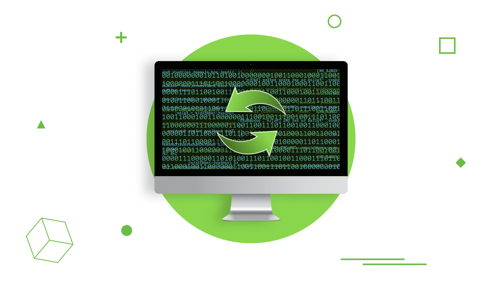

# Debugging Python Applications with pdb



Debugging isn’t a new trick – most developers actively use it in their work. Of course, everyone has their own approach to debugging, but I’ve seen too many specialists try to spot bugs using basic things like print instead of actual debugging tools. Or even if they did use a debugging tool, they only used a small set of features and didn’t dig deeper into the wide range of opportunities good debuggers offer. And which could have saved those specialists a lot of time.

## Debugging Python with the Print Command

As mentioned above, some of us use `print` to display information that reveals what’s going on inside the code. Some of us use a logger for the same purpose – but please don’t confuse this with the logger for the production code, as I’m referring to developers that only add the logger during the problem searching period, i.e. just until the developing process ends.

But the truth is, print has a lot of loopholes. Probably, its biggest drawback is that you have to add changes to your code, then re-run the application to see the different variable you’re writing, or the current variable type, for example. So how is a debugger better?

## Python Debugger Commands

Essentially, a debugger is a tool that gives you a way to, let’s say, open up the application in a certain spot so you can have a look at your variables, call stack, or whatever you need to see, set conditional breakpoints, step through the source code line by line, etc. It’s like opening the hood of your car to see where the smoke is coming from, searching part by part to identify the problem.

If you’re working with Python, not only can you look through the code during debugging, but you can also run the code that’s written in the command line or even affect the process by changing the variables’ value.

Python has a built-in debugger called pdb. It’s a simple utility with a command line interface that does the main job. It has all the debugger features you’ll need, but if you’re looking to pimp it up a little, you can extend it using ipdb, which will provide the debugger with features from IPython.

The easiest way to use pdb is to call it in the code you’re working on.

```
import pdb; pdb.set_trace()  
```

As soon as the interpreter reaches this line, you’ll receive a command prompt on the terminal where you’re running the program. This is a general Python prompt, but with some new commands.

#### list(l)

The list(l) command will show you the code line the Python interpreter is currently on. If you want to check a different area of the code, this command has arguments for the first and the last lines to show. If you provide only the number of the first line, you’ll get to see the code around the line you’ve given.

#### up(p) and down(d)

Up(p) and down(d) are the two commands needed to navigate through the call stack. With the help of these commands, you can see who is calling the current function, for example, or why the interpreter is going this way.

#### step(s) and next(n)

Another important pair of commands, step(s) and next(n), help you continue the execution of the application line by line. The only difference between these two is that next(n) will only go to the next line of the current function, even if it has a call for another function, but step(s) will go deeper in a case like this.

#### break(b)

The break(b) command allows you to set up new breakpoints without changing the code. It requires a bit more explaining, so I’ll go into detail below.

Here’s a short overview of other `pdb` commands:


## Python Debugger In Advance
Previously, code changes were necessary to print something or set a breakpoint. However, quite often you need to set the breakpoint inside a third-party package. Of course, you can open the source code of a library at any time from your virtual environment and add a call for pdb.

But now you can run the application from the debugger and set breakpoints without any changes in the source code. To execute the application with the debugger, use the command `python -m pdb <python script>`.

Let me show you an example. I have this simple application that tracks my working time. Inside it, I use the  requests library to make HTTP requests, and I want to break on a post request. How do I do this? I run my application with the debugger and set a breakpoint inside the requests library.

```
$ python -m pdb run.py
> /Users/.........................../run.py(1)<module>()
-> from TimeLog.app import run_app
(Pdb) b requests/sessions.py:555
Breakpoint 1 at /..................../lib/python3.6/site-packages/requests/sessions.py:555  
(Pdb) c
```

As you can see, you don’t need to enter the full path to the source file. You just put a relative path from any folder in sys.path, the same way you would make an import into your code.

Now it’s easier to set the breakpoint. There’s no need to put it somewhere in your own code and go step-by-step to the function you need, or to find the library source file and change it.

But what if the application does a lot of calls, and you need one particular call? Easy. You can specify a breakpoint condition, and the debugger will break the application only if this condition will be considered True.

In this example, the application will break only if `json` has a `time_entry` key.

```
$ python -m pdb run.py  
> /Users/...../run.py(1)<module>()
-> from TimeLog.app import run_app
(Pdb) b requests/sessions.py:555, json is not None and 'time_entry' in json
Breakpoint 1 at /Users/....../lib/python3.6/site-packages/requests/sessions.py:555  
(Pdb) c
```

## Debug Helper for Django

If you’re using the Django web framework, you probably know that if `DEBUG` is set to True in your settings, then on any exception you’ll see a special page with information such as exception type and message, traceback, local variables, etc.

If you want to enhance your debug page like this, install [django-extensions](https://django-extensions.readthedocs.io/en/latest/) and use the runserver_plus command to start your Django server for development. And in case you need to set up a debugger pin, here’s an example of how you do it:

```
$ WERKZEUG_DEBUG_PIN=1234 ./manage.py runserver_plus
```

If you use django-extensions instead of this default page, you’ll get a traceback page where you can see the code for each and every line and an open debugger.

The debugging process is carried out with the help of the [Werkzeug](http://werkzeug.pocoo.org/) project, which is a WSGI library for Python.

As you can see, there are numerous ways to use a debugger. It’s not too complicated, but at the same time, it will give you tons of advantages – not only will you earn a reputation as a kickass developer, but you’ll also save yourself a lot of time and energy, and learn how to avoid different bugs in the future. And, of course, both the product and your client will win if you use a proper debugger. So, it’s literally a win-win for everyone.


This article about [debugging python applications with pdb](https://djangostars.com/blog/debugging-python-applications-with-pdb/) is originally posted on Django Stars blog.