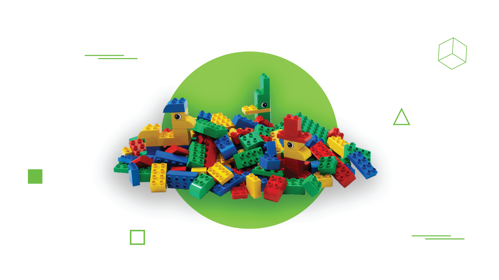
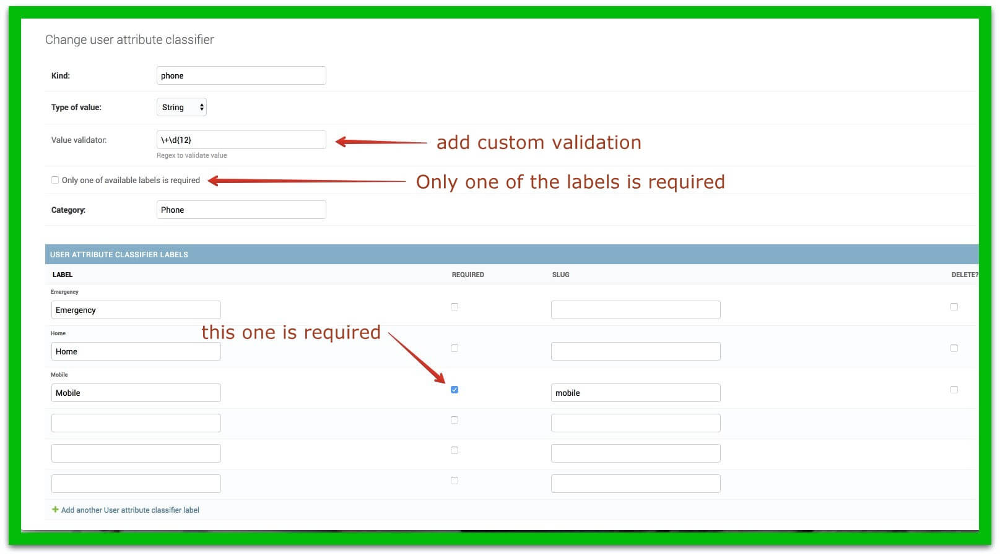
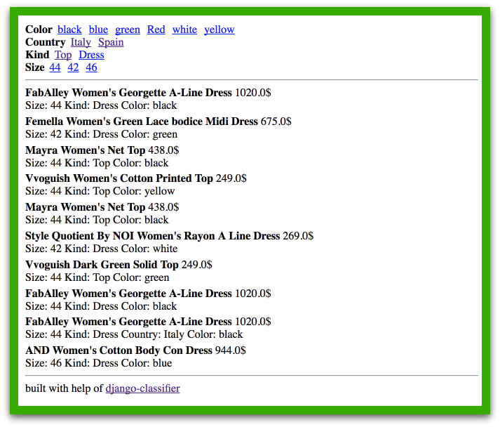

# Django-Classifier or What Have I Done?



From time to time you have to build some properties for an object and usually those are just a bunch of fields for a model. With [django-classifier](https://github.com/django-stars/django-classifier) you may do that in another way. It allows you to create models at start, and set the properties needed from the admin panel at any time.

Let me show you two demo projects. First one is the “user profile” I’ve built for our internal website. The second one shows the way to build online store products with dynamic properties and the option to apply filters for those.

## Demo Project #1

[First example](https://github.com/django-stars/django-classifier-profile) is pretty simple, however it shows the way to extend functionality that django-classifier provides.

I had a task to make the extension of the user profile possible at any time, while being able to add as much properties as possible. The most interesting part of this example is the division of the properties by categories/groups and fetching specific data from properties.

At first, I added three models as it’s described in the [tutorial](https://django-classifier.readthedocs.io/en/latest/tutorial.html), but `UserAttributeClassifier` was extended with category field and `UserAttributeClassifierLabel` with slug field. We will need slug field in label model to fetch specific data from the properties in future.

### Models’ listings:

```
class UserAttributeClassifier(ClassifierAbstract):  
    category = models.CharField(max_length=100)

    class Meta:
        ordering = ('category', )


class UserAttributeClassifierLabel(ClassifierLabelAbstract):  
    # have to be the same as in database to be able to fetch specific value
    GENERAL_BIRTHDAY = 'birthday'
    PHONE_MOBILE = 'mobile'
    IM_SKYPE = 'skype'

    classifier = models.ForeignKey(
        UserAttributeClassifier,
        related_name='labels'
    )
    slug = models.CharField(max_length=100, null=True, blank=True)

    class Meta:
        ordering = ('label', )


class UserAttribute(models.Model):  
    user = models.ForeignKey(User, related_name='attributes')
    label = models.ForeignKey(UserAttributeClassifierLabel, related_name='+')
    value = models.CharField(max_length=200)
```

All the user attributes/properties are editable from the [admin](https://github.com/django-stars/django-classifier-profile/blob/master/django_classifier_profile/apps/account/admin.py#L35) panel.

* Each group has validation on type of data, and you can add custom validation based on regex expression (check phone attribute in [django-classifier-profile](https://github.com/django-stars/django-classifier-profile) demo project)
* Each attribute can have a bunch of labels. For example attribute “social link” may have: “facebook”, “twitter”, “Instagram”, etc.
* You can set what labels are required or set that only one of the labels is required



User attributes are presented in the admin user edit form as general Django admin inlines.

On the frontend it works [the same way](https://github.com/django-stars/django-classifier-profile/blob/master/django_classifier_profile/apps/account/formsets.py#L7) with the help of **Django formsets**.

### Django formsets listing

```
class UserClassifierFormSet(ClassifierFormSet):  
    """
    extended with one additional method to get forms grouped by category
    """

    @cached_property
    def grouped_forms(self):
        """
        grouped forms by category and filter options of kind field
        """
        self.empty_forms = {}
        forms = {}
        for kind in UserAttributeClassifier.objects.all():
            self.create_empty_form(kind)
            labels = list(kind.labels.values_list('pk', flat=True))
            forms[kind.category] = []
            for form in self.forms:
                label_id = None
                try:
                    label_id = form.cleaned_data['label'].pk
                except (AttributeError, KeyError):
                    label_id = form.data.get('label', form.initial.get('label'))

                if label_id in labels:
                    form.fields['label'].choices = kind.labels.values_list(
                        'pk', 'label'
                    )
                    forms[kind.category].append(form)

        return sorted(forms.items(), key=lambda i: i[0])

    def create_empty_form(self, kind):
        """
        returns empty form for specific attribute
        """
        form = self.form(
            auto_id=self.auto_id,
            prefix=self.add_prefix('__prefix__'),
            empty_permitted=True,
            use_required_attribute=False,
            **self.get_form_kwargs(None)
        )
        self.add_fields(form, None)
        form.fields['label'].choices = kind.labels.values_list('pk', 'label')
        form.fields['user'].initial = self.initial_extra[0]['user']

        self.empty_forms[kind.category] = form
```


## Demo Project #2

My [second demo project](https://github.com/django-stars/django-classifier-shop) doesn’t extend classifier models. The main idea here is to show what possibilities it gives. It is a very basic online shop with the products that have properties built with the help of django-classifier.

Here I use attributes to build facet search for products, and I think that’s pretty cool. As soon as you add a new attribute to the product — it allows you to apply filters by that attribute without making any changes to the code.



All the “how to build it” logic is based on the two signal receivers. First one to reindex product, and the other one to update ElasticSearch mapping on attributes configuration changes.

Product app has a [method](https://github.com/django-stars/django-classifier-shop/blob/master/django_classifier_shop/apps/product/apps.py#L28) to update mapping on ElasticSearch that sets **keyword** type for all product attributes, and in the [view](https://github.com/django-stars/django-classifier-shop/blob/master/django_classifier_shop/apps/product/views.py#L43) we use terms aggregations to build filters.

## Outro

Django-classifier is a flexible constructor to create dynamic list of heterogeneous properties for various entities. This set of helpers is useful for creating contacts properties or attributes for descriptions of any kind of products. You’ll need to create your own models for each kind of entity, but it gives you more flexibility and allows you to easily change default behavior.


This article about [django classisier](https://djangostars.com/blog/django-classifier-or-what-have-i-done/) is originally posted on Django Stars blog.