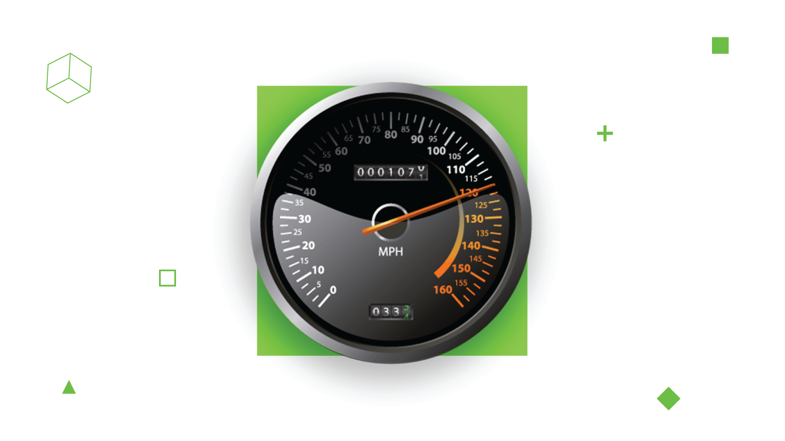

# How to Improve Django Performance. Optimization Tips



I frequently face a recurring situation when [developers](https://djangostars.com/services/web-development/) receive a task to make a performance optimization on Django. Pretty often they are trying to make it in a wrong way. In this short article I want to shed some light on the common mistakes, and show you the way I’m searching for bottlenecks.

## Database optimization

I saw how people start the optimization of database queries that take about 5% of all the request for so many times. Unfortunately, most of the developers simply add `select_related`/`prefetch_related` to their Django QuerySets to decrease the count of queries to the database. That decreases the number of queries indeed, but what about time? Such changes will increase the amount of time needed to complete the request, and what is more important it can increase the time needed on production server significantly.

## Never try to optimize queries on your development machine

“The Postgres planner collects statistics about your data that help identify the best possible execution plan for your query. In fact, it will just use heuristics to determine the query plan if the table has little to no data in it. Not only do you need realistic production data in order to analyze reasonable query plans, but also the Postgres server’s configuration has a big effect. For this reason, it’s required that you run your analysis on either the production box, or on a staging box that is configured just like production, and where you’ve restored production data”.

[(an excerpt from the Harold’s Geminez article)](https://robots.thoughtbot.com/postgresql-performance-considerations)

In terms of database optimization, I prefer to have the log of long queries and work with it. It doesn’t matter if that’s going to be a NewRelic or just a PostgreSQL log.

## Code optimization

Probably, everyone knows about `django-extension` with `RunProfileServer` but I think that this solution is not very comfortable to work with. It provides you with a lot of data in the format that is quite hard to read.

I use [line_profiler](https://github.com/rkern/line_profiler) instead. This package allows you to check the performance of specific parts of the code. Basically, you have to write the script to evaluate code that you need and put `@profile` decorator to methods you are interested in.

As a result, you will receive:

* The amount of time taken by each method
* Total time spent
* Time per hit
* Amount of hits
* Time for each line of the method shown in percents

I use two options to run view in Django project to check performance. The first one is easier but it doesn’t reveal middlewares and Django code. The second one is a bit more complicated but it gives the possibility to measure middlewares.

```
#!/usr/bin/env python
import os

os.environ.setdefault(  
    'DJANGO_SETTINGS_MODULE',
    'django_classifier_profile.settings'
)
import django  
django.setup()


from django.test.client import RequestFactory

from django_classifier_profile.apps.account.models import User  
from django_classifier_profile.apps.account.views import ProfileEditView


request_factory = RequestFactory()  
user = User.objects.get()

request = request_factory.get('/')  
request.session = {}  
request.user = user

view = ProfileEditView.as_view()  
view(request).render()
```

Here I create a fake request and call the view directly. We need to call render method of the view to run template rendering and evaluate lazy objects.

```
#!/usr/bin/env python
import os

os.environ.setdefault(  
    'DJANGO_SETTINGS_MODULE',
    'django_classifier_profile.settings'
)
import django  
django.setup()


from django.core.servers.basehttp import get_internal_wsgi_application  
from django.test.client import RequestFactory

from django_classifier_profile.apps.account.models import User


request_factory = RequestFactory()  
user = User.objects.get()

request = request_factory.get('/')  
request.session = {}  
request._cached_user = user  
#request.user = user

app = get_internal_wsgi_application()  
app.get_response(request)
```

In this script, I use WSGI application to call view and it gives the possibility to evaluate all the Django flow with middlewares and template rendering. To get results you should run two commands only. First one to evaluate profiled code, write and dump statistics to file:

```
$ kernprof –l <script_name.py>
```

and the second one to show the results of profiling

```
$ python -m line_profiler <script_name.py>.lprof
```

The result will look like this:

```
Timer unit: 1e-06 s

Total time: 1.4e-05 s  
File: /Users/quard/.pyenv/versions/3.5.3/envs/django-classifier-shop/lib/python3.5/site-packages/django/contrib/auth/middleware.py  
Function: process_request at line 17

Line #      Hits         Time  Per Hit   % Time  Line Contents  
==============================================================
    17                                               @profile
    18                                               def process_request(self, request):
    19         1            2      2.0     14.3          assert hasattr(request, 'session'), (
    20                                                       "The Django authentication middleware requires session middleware "
    21                                                       "to be installed. Edit your MIDDLEWARE%s setting to insert "
    22                                                       "'django.contrib.sessions.middleware.SessionMiddleware' before "
    23                                                       "'django.contrib.auth.middleware.AuthenticationMiddleware'."
    24                                                   ) % ("_CLASSES" if settings.MIDDLEWARE is None else "")
    25         1           12     12.0     85.7          request.user = SimpleLazyObject(lambda: get_user(request))

Total time: 0.005354 s  
File: /Users/quard/Projects/learn/django-classifier-profile/django_classifier_profile/apps/account/views.py  
Function: get_object at line 18

Line #      Hits         Time  Per Hit   % Time  Line Contents  
==============================================================
    18                                               @profile
    19                                               def get_object(self, queryset=None):
    20                                                   if (
    21         3            9      3.0      0.2              not self.kwargs.get(self.pk_url_kwarg)
    22         1            2      2.0      0.0              and not self.kwargs.get(self.slug_url_kwarg)
    23                                                   ):
    24         1            9      9.0      0.2              self.kwargs[self.pk_url_kwarg] = self.request.user.pk
    25
    26         3         5272   1757.3     98.5          user = super(ProfileEditView, self).get_object(queryset=queryset)
    27
    28         3           60     20.0      1.1          if user != self.request.user and not self.request.user.is_superuser:
    29                                                       raise HttpResponseForbidden
    30
    31         3            2      0.7      0.0          return user

Total time: 0.010449 s  
File: /Users/quard/Projects/learn/django-classifier-profile/django_classifier_profile/apps/account/views.py  
Function: get_formset at line 59

Line #      Hits         Time  Per Hit   % Time  Line Contents  
==============================================================
    59                                               @profile
    60                                               def get_formset(self):
    61                                                   """
    62                                                   create formset of attributes with help of custome formset class
    63                                                   """
    64         1            1      1.0      0.0          FormSetClass = modelformset_factory(
    65         1            1      1.0      0.0              UserAttribute,
    66         1            1      1.0      0.0              formset=UserClassifierFormSet,
    67         1            1      1.0      0.0              form=UserAttributeForm,
    68         1            0      0.0      0.0              can_delete=True,
    69         1          892    892.0      8.5              extra=0
    70                                                   )
```


This article about [django](https://djangostars.com/blog/django-performance-optimization-tips/) is originally posted on Django Stars blog.