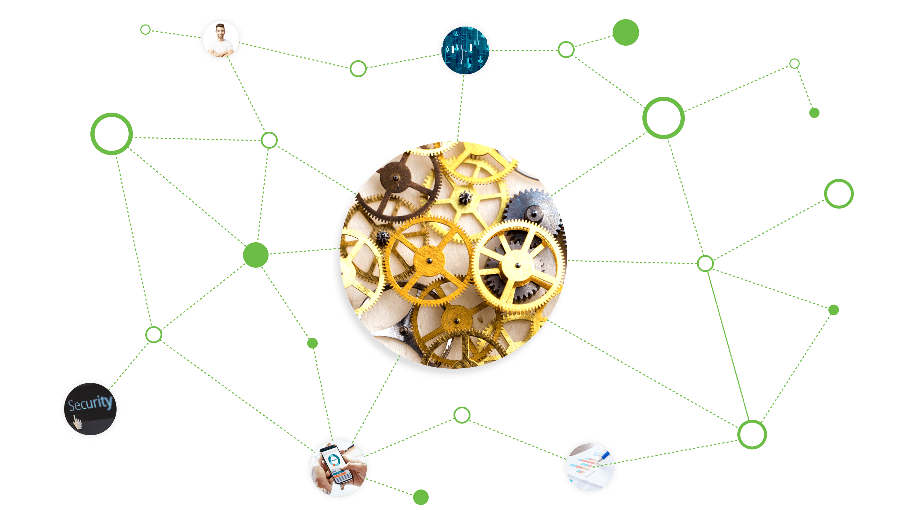
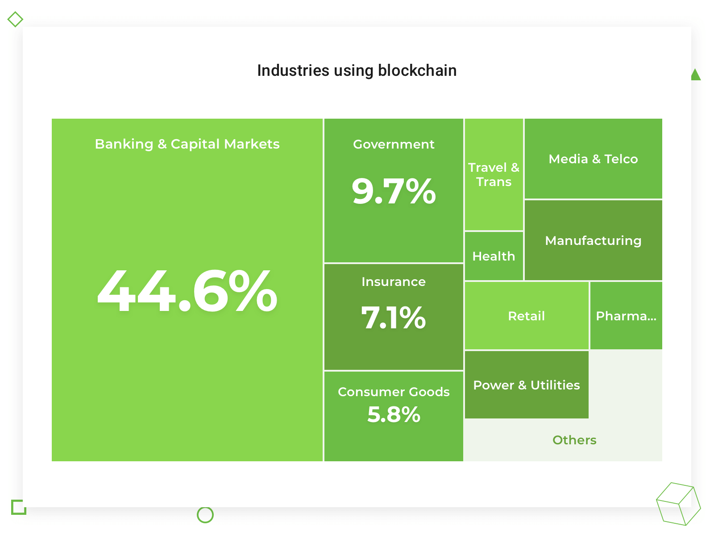

# How to build your own blockchain for a financial product



> Technologies are changing fast; people are not. – Jakob Nielsen

Blockchain is a relatively new technology that many deem is used only for buying Bitcoins. They try to implement it in whatever sphere comes to mind, whether it is fashion, education or healthcare. I would say it is okay — too little time has passed to determine which area of human activity can benefit the most from applying this technology. To understand the practical application of blockchain, we must first define why it appeared, and then study cases when blockchain can make a significant difference.

Note: This article does not explain the blockchain concepts; instead, it focuses on [developing a fintech application](https://djangostars.com/industries/fintech/) using this technology. I will explain why fintech can already adopt the blockchain, and most importantly, focus on developing a decentralized application using this technology.

## Industries That Are Ready For Blockchain

Don Norman once wrote that many products failed because they were released at the wrong time. I can remake this statement and say: Many technologies fail to find practical applications. When the Internet became widely available in the beginning of the ‘90s, each sphere tried to apply it to their business. It was a catastrophe, and its consequences are still visible by thousands of never-visited websites with horrible interfaces, clumsily created by anyone who had a computer. We are currently witnessing virtually the same situation—the most potential technology of the decade is associated with speculations on crypto-exchanges. It is widely used for financial scams, although it was initially created for the contrary.


Source: [Microsoft Azure](https://azure.microsoft.com/en-us/blog/accelerating-the-adoption-of-enterprise-blockchain/)

An attempt to exclude the human factor from the business was one reason why blockchain appeared. That is why the industries that may have blockchain successfully implemented are those that (1) heavily depend on human activity, and (2) suffer most from human errors, like finance.

**Important:** Blockchain is being applied to various products from different industries; we just need more daring entrepreneurs who are willing to put a lot at stake.

Fintech deals with a very thorny matter – money. It is exactly where most fraud takes place. The desire to become richer is one fundamental mechanism that pushes people to do things, often bad things. Fintech startups aim to improve the traditional financial institutions, for example, excluding the human factor from the financial activities.

Utilizing blockchain excludes third parties from the financial transactions, like a bank that verifies the person between which the transaction is made. It can be used for managing the inventory and logistics, trading goods, optimizing the person identification, tracking transactions and more.

> Read: [What you need to consider before building a fintech product](https://djangostars.com/blog/what-you-need-to-consider-before-building-a-fintech-product/)

It does not mean that every [fintech product](https://djangostars.com/blog/how-to-build-a-unique-technology-for-your-fintech-product-with-python/) can easily adopt blockchain. Here are some cases when you might want to use blockchain:

* **You want to attract investments.** Like it or not, blockchain is still a buzzword. It attracts more investments than real, working products.
* **You want to increase your competitiveness in the market.** If you manage to build a product on blockchain successfully, you will instantly show your professionalism, thus becoming more attractive to investors and customers.
* **You are ready to experiment.** Yes, any blockchain-based product is an experiment because few know what this technology is capable of. If you are ready to make a breakthrough in your industry, blockchain could be a right choice.

I do not suggest implementing blockchain in the following cases:

* **You are limited in resources.** It is a high-risk way to creating a product because (1) there are few blockchain engineers, and (2) it is expensive to have them in the team.
* **You are not ready for significant changes.** The changes include operational management and human resources. If you are a bank that has implemented blockchain, you will most likely need to let many employees go since there will be less work for people.
* **You have short-term vision.** Blockchain is about long-term perspective. It cannot be implemented in a month or so. Unless you have a long-term product roadmap, do not bother yourself with dreams about changing everything tomorrow.

What you can do tomorrow, and even while reading this article, is to build a simple blockchain. It is the focus of part 2. I will tell you about the main components that are required to build a blockchain for fintech products, propose some tools, and show real pieces of code with explanations.

## How To Apply Blockchain In Fintech

### ‘Frameworks’ to use

#### CryptoNote

CryptoNote is an open-source project that allows you to create crypto coins. They have a simple, step-by-step guide to creating a cryptocurrency. To launch it, you will need to have two nodes which will be used to run the Monero server.

**Useful links:**

[How to create a coin](https://cryptonotestarter.org/inner.html)

[How to create a wallet](https://cryptonotestarter.org/create-wallet.html)

#### Ethereum

A popular open software platform for building decentralized applications. Its focus is running the programming code of your blockchain-based app. Quoting the Ethereum website: _“Ethereum is a decentralized platform that runs smart contracts: applications that run exactly as programmed without any possibility of downtime, censorship, fraud or third party interference.”_

## Build simple blockchain

Now that you know the tools – Cryptonote, Ethereum and ZeroNet – we are moving to building a basic blockchain of our own. I will be using Python in this example, but if it is not your primary coding language, you will still understand the logic and be able to write it in another language.

First, I will explain the fundamental elements required to build a block. I will start with date of creation, nonce, checksum and transaction data. Transaction data in our case could be just a string to simplify the code.

#### Date of creation
It is the current and time in unix format. It is required for the future development of your blockchain; when there are many running nodes and you add a new block to your branch, the node will decide which block to use based on Date of Creation.

#### Nonce
It’s a unique set of symbols that we need to add to the block to build the checksum that fits the requirement. For example, if the nonce value is 5, then we have to add 5 zeros (00000) to the data block to calculate the right checksum.

#### Checksum
Also sometimes referred to as hash value, hash code, or simply a hash. It is block data with nonce plus checksum of previous block. SHA256 protects the ledger chain from being rewritten.
How it works: Node calculates the checksum and compares to the one of the new block; if they match, the block is added to the blockchain.

#### Data
It’s a set of data that will be stored in block and signed. It can contain any sort of data: e.g., bitcoin stores a list of transactions, not only the last transaction; or you can store the information about the computer that created the block, like its MAC address; or you can have a more detailed date of creation, say, adding the time zone.

#### Proof of work
Proof of work (PoW) is a unique consensus algorithm in a blockchain network. It is used to validate the operations and the creation of new chains in the blockchain network. The main idea of PoW is to add complexity to building a block on the client side and reduce the load on the server side. For example, I say checksum has to have 5 lead zeros; it means that we will increase nonce until checksum will not have 5 lead zeros.

## Let’s start with a code

First of all, I will create a class for a block. It will be a very simple class with a constructor, a method for calculating the checksum and property to check that block is valid. We will have two constants, one for number of lead zeros in checksum and a second to identify which symbol we will use with the nonce.

```
import time  
from hashlib import sha256

class Block:  
    CHECKSUM_LEAD_ZEROS = 5
    NONCE_SYMBOL = 'Z'

    def __init__(self, prev_block, data):
        self._prev_block = prev_block
        self.data = data
        self.checksum = None
        self.nonce = 0
        self.timestamp = time.time()

    @property
    def is_valid(self):
        checksum = self.calculate_checksum()

        return (
            checksum[:self.CHECKSUM_LEAD_ZEROS] == '0' * self.CHECKSUM_LEAD_ZEROS
            and checksum == self.checksum
        )

    def calculate_checksum(self):
        data = '|'.join([
            str(self.timestamp),
            self.data,
            self._prev_block.checksum,
        ])
        data += self.NONCE_SYMBOL * self.nonce

        return sha256(bytes(data, 'utf-8')).hexdigest()
```

#### Constructor
Constructor accepts only two parameters; the first is a previous block, and the second is the current block data. Also, constructor creates the time mark and sets nonce to zero as its initial value.

#### Is valid
A property that calculates checksum and compares if the current one is equal to the calculated and has the right number of zeros.

#### Calculate checksum
The most complicated method in our code. This method packs the time mark, data, and checksum of the previous block to one string. Then we add a nonce string; in our case, it will be a list of ‘Z’. Then it calculates the checksum of result string.

Now we have a simple yet fully functional block. I will move on to creating a chain of blocks. For now, it will be a simple chain without the ability to store and load data, but it will convey the main idea.

```
import json

class Chain:

    def __init__(self):
        self._chain = [
            self._get_genesis_block(),
        ]

    def is_valid(self):
        prev_block = self._chain[0]
        for block in self._chain[1:]:
            assert prev_block.checksum == self._prev_block.checksum
            assert block.is_valid()
            prev_block = block

    def add_block(self, data):
        block = Block(self._chain[-1], data)
        block = self._find_nonce(block)
        self._chain.append(block)

        return block

    @staticmethod
    def _get_genesis_block():
        genesis_block = Block(None, None)
        genesis_block.checksum = '00000453880b6f9179c0661bdf8ea06135f1575aa372e0e70a19b04de0d4cbc7'

        return genesis_block

    @staticmethod
    def _find_nonce(block):
        beginning = '0' * Block.CHECKSUM_LEAD_ZEROS
        while True:
            checksum = block.calculate_checksum()
            if checksum[:Block.CHECKSUM_LEAD_ZEROS] == beginning:
                break
            block.nonce += 1

        block.checksum = checksum

        return block
```

**Let’s take a look at methods in our chain class:**

#### Constructor
I just created a chain with only one block – a genesis block. Genesis block is a first block of the chain and has only a checksum. This block is required for adding the first real block to the chain because the real block requires a checksum of the last block in the chain.

#### Adding a new block
It has only one parameter — data for a new block. This method creates a new block with the given data and run method to find a correct nonce value. Only then, it will append a new block to the chain.

#### Find the nonce
This method aims to find the right nonce for a block. It has an infinite loop where I increase the nonce and calculate a new checksum. Then it compares the checksum with the rules — for now, it is only the number of zeros.

#### Validate the chain
This method tells us if the chain is valid. It goes through all blocks in the chain and checks if each block is valid.

## Bottom Line

In this article, I attempted to prove that building a simple yet working blockchain is not as difficult as it may seem. My general advice is to take the lesson you learned here and start playing with blockchain by experimenting with blocks and data. All great products, including blockchain, were experiments once.

If you are from the fintech industry, I suggest you study more about the products that are using blockchain. Some things about them are certain; they are more secure, more attractive for investments, and, if they succeed in the global market, will be called game changers. The first step of adapting the new technology has been taken. The next step is to spread the knowledge and educate people about the features of blockchain.

Stay tuned for the next part about blockchain and fintech, most likely with more complex pieces of code and suggestions on its practical application in fintech from our Python development company.


This article about [blockchain for a financial product](https://djangostars.com/blog/how-to-build-your-own-blockchain-for-a-financial-product/) is originally posted on Django Stars blog.