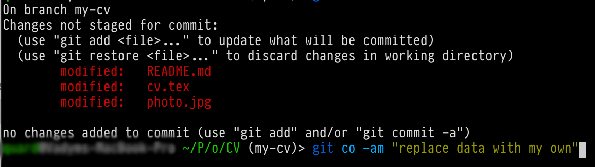
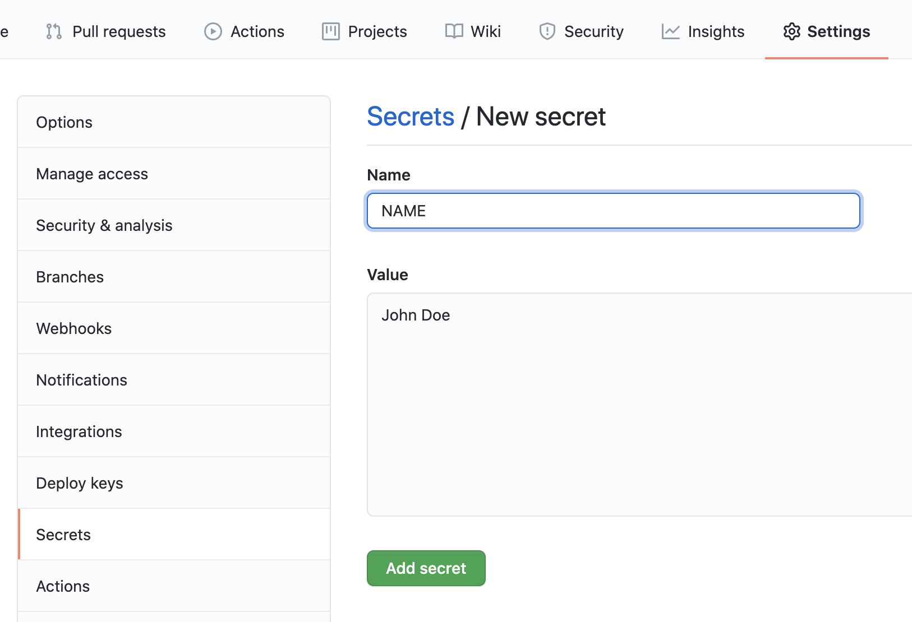
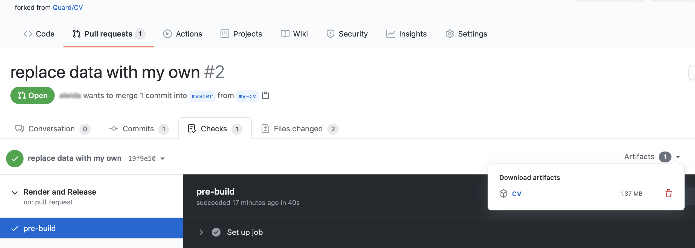
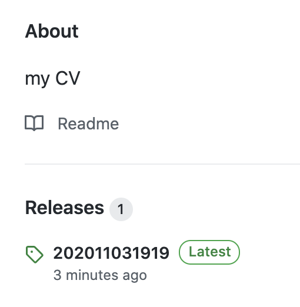

# Managing CV with help of LaTeX and GitHub

First of all I want to mention that I use LaTeX for my CV. It's quite an old story, I have investigated LaTeX for myself firstly as a tool for producing different reports or printouts in web projects. Probably biggest result of this investigation was that I found the moderncv package and created my CV with help of it.

The main benefits for me were that I have a formalized structure and do not need to spend time on the markup. I just choose a template that I line and work only with content. The most painful part, for me, was keeping single markup in all parts of the CV, and now it was fixed.

Yes, of course, LaTeX is not the easiest markup language to use especially if you don't want to spend a lot of time learning it. But it's quite enough intuitive and popular to be able to find answers for own questions with help of google, for example. My main source of knowledge is [Overleaf](https://www.overleaf.com/learn), it's an online LaTeX editor(which I never try, to be honest), but they have great documentation which is simple and short. Other questions, mostly more technical, usually you could google.

For many years I have kept my CV in some cloud storage, like GDrive or Dropbox. But such storage is not so comfortable to use for me. Now I tried to move my CV in a public repository in GitHub, and build a PDF from a LaTeX file using GitHub Actions instead of setting up LaTeX on my laptop. Which is more useful for me. Now I am able to do a change right on GitHub and create a pull-request that will build a PDF file and put it to test artifacts. But as soon as I merge pull-request, or just push changes into the master branch, the written workflow will build a new PDF file and publish it to the GitHub Release section of my repository. Which is also very useful. And all these scripts give me the possibility to do changes using only GitHub and they have an online editor to change files.

I tried to change my CV repository in a way to be more flexible, that first version, and give the possibility to fork it, do not make huge changes to use it for your own CV.

Now I will try to describe all steps that you need to do to create your own CV using my project:

### First step:

Fork [repository](https://github.com/Quard/CV)

### Second step:

Create a branch to do changes.

### Third step:

Change the content of `cv.tex` with your data and replace the photo with yours

### Fourth step:

Add one secret that will contain the future name of your CV file. The name of the secret should be `NAME`. Be careful, if you will use spaces, in a result GitHub will replace them with dots. For example `John Doe` will be `John.Doe`.

### Fifth step:

Change link to result file in `README.md`. This link will always point to the CV file in the latest release, so you don't need to change it every time when you do any changes in the CV.

### Sixth step:

Create a Pull Request of your changes and you will find a built PDF file in test artifacts in GitHub Actions.

If everything is ok, just merge and your CV will appear in the Releases section.

That’s all, you have your pretty CV in your GitHub.
