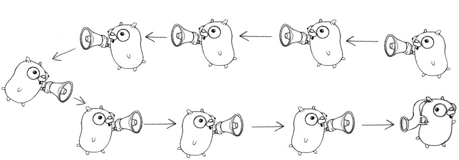
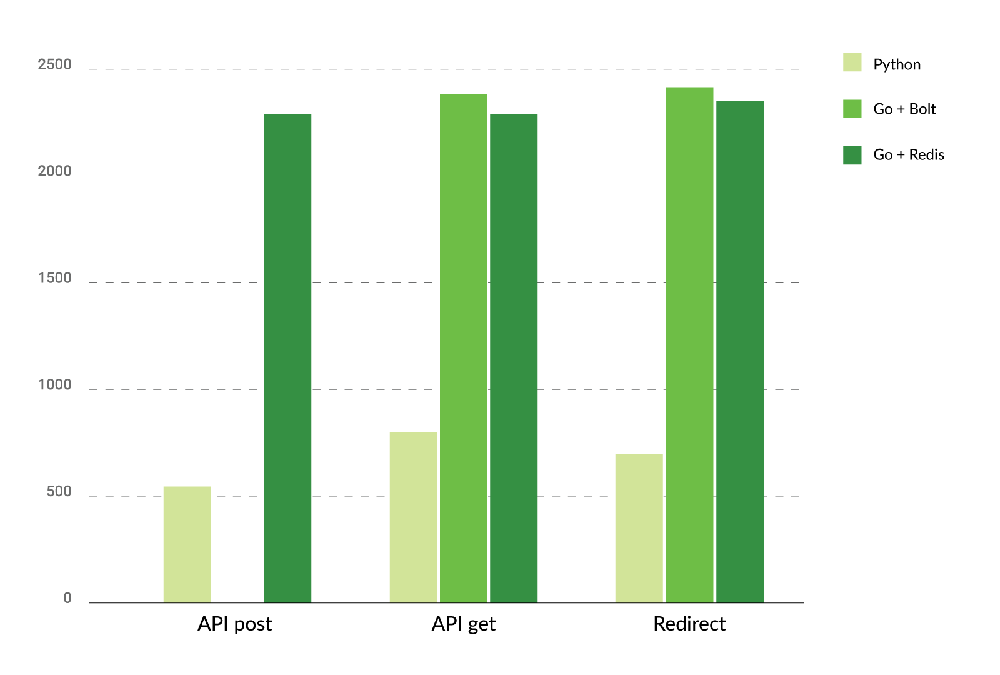

# My Story with Go, Python, and Benchmarks

Hello, my name is Vadym, and this is my story about how I started learning Go, what it felt like compared to Python (the language I currently use at work), and benchmarking.

I believe that every developer should learn constantly to be good at what they do. And it’s not only about knowing new frameworks, databases, or platforms like AWS Lambda. It’s about knowing how the services you use from day to day interact with each other, differentiate when your favorite language uses a link to an object or a copy of the object, and many other things.

I’ve been using Python as my main language for writing production code for 10 years. But even as a devoted Python developer, I’ve tried different languages over time. I like to learn new languages, because I might pick up something for my daily work – even from ones I won’t use or from languages I don’t really like, such as Ruby or Java. Also, it’s not very important for me to learn new languages only. I like to spend time on old and rarely used languages as well. For example, I’ve tried Lisp for more than writing a config for Emacs. I also like Erlang a lot, but it’s not very popular nowadays.

## Getting to Know Go

A few weeks ago, I started searching for a new language to learn. First of all, I started investigating Elixir, as I like Erlang, but I don’t really like it after reading the tutorial. After a few days, I settled on Go, as I’ve heard a lot about this language from different sources. At first sight, the language didn’t seem complicated, but it required a different approach to the application architecture than Python, for example. So I decided to delve deeper into Go.

### Step One

What I did first was to have a look at the Go community. The Go community has an amazing tutorial that teaches you a lot about the language right away. I believe it’s a great starting point: [www.tour.golang.org](https://tour.golang.org/). The tutorial is split into three sections, plus a welcome section:

* **Basic** shows you the basics of Go syntax, how to work with variables and functions, flow control statements and more complex types.

- **Method and interfaces** explains how to create and implement interfaces.
- **Concurrency in Go** explains all the basics on the subject.

All of these sections have simple practical tasks that cover what you have learned.

### Step Two

The next step to learning Go was watching presentations. The best one (in my opinion) is [Go Concurrency Patterns](https://www.youtube.com/watch?v=f6kdp27TYZs) by Rob Pike. This presentation is easy to watch and very motivating. I also recommend watching YouTube suggestions based on this video.



### Step Three

Before I tried creating my own simple application, I had studied another great tutorial –[ Learn Go with tests](https://github.com/pityonline/learn-go-with-tests). This tutorial explains Go and how to write code using the methodology of test-driven development.

After going through all these tutorials and videos, I decided to finally try to write a simple application with Go myself. I chose to write a URL-shortener service, similar to bit.ly or goo.gl, but simpler, without statistics and UI. (I may add them in the future.)

First, I attempted to create a channel with a set of prepared short strings to identify long URLs. It was an excellent exercise for working with channels and goroutines. But for now, I don’t use this code in service and generate short strings each time I need to store a long URL. Next, I started writing code for the application – short string generation code with tests at first. When I started thinking about storage, I got stuck. This happened because I didn’t understand how to split my code correctly. For me, the answer was in the[ project layout](https://github.com/golang-standards/project-layout) of the Go standard library and in checking out some popular Go libraries and applications. Also, I found [Go modules](https://github.com/golang/go/wiki/Modules) that weren’t highlighted in any of the tutorials.

```
.
├── api
│   └── openapi.yaml
├── build
│   ├── ci
│   │ └── .travis.yml
│   ├── Dockerfile
│   └── docker-compose.yml
├── internal
│   ├── generator
│   │ ├── generator.go
│   │ └── generator_test.go
│   └── storage
│       ├── redis_storage.go
│       ├── redis_storage_test.go
│       ├── simple_storage.go
│       ├── simple_storage_test.go
│       └── storage.go
├── third_party
│   ├── locustfile.py
│   ├── redoc-static.html
│   └── wrk_post.lua
├── .gitignore
├── .travis.yml -> build/ci/.travis.yml
├── LICENSE
├── README.md
├── go.mod
├── go.sum
└── main.go
```

I started my second attempt by describing OpenAPI schema for my API. Then I copied the generating function from the previous code and started working on URL storage. As I was researching project layouts for Go applications, I found Bolt – a simple key-value storage library written in Go. The description of this library says that the storage can be used to store a large amount of data. I decided to try it, as the approach I used allowed me to easily replace this library with different data storage without changing a lot of code.

## Benchmarking and Python vs. Golang Performance

My first application in Go is ready, and I want to do a benchmark test. Usually, I use wrk to do so,  but this time I decided to use Locust. With Locust, it’s easier to create a test that will use all the endpoints I have at the same time. I was surprised when the result was about 43 requests per second, which is a quite small number. My first assumption was that the number was so small because the storage uses only files on my disk. I decided to write the same application in [Python using asyncio](https://djangostars.com/blog/asynchronous-programming-in-python-asyncio/), aiohttp and aioredis as storage, check the results, and then implement storage that uses Redis in a Go application.

And it worked! I got the same result as the benchmark test for both applications in Python and Go. First of all, I ran wrk to test the API endpoint to retrieve the long URL by short string. It was the right decision, because I received different results. The Go application was 9 times faster, and Python did more than 43 requests in a second. The numbers were now about 280 requests per second for Python, and 2500 for Go. Which, from my point of view, is closer to the truth. Locust probably suggests having slaves to do proper testing instead of using fork/threads, and that’s why 43 requests per second is the limit for Locust in the current setup.

| **Go + Bolt (GET)**                                          | **Python + Redis (GET)**                                     |
| ------------------------------------------------------------ | ------------------------------------------------------------ |
| `Running 30s test @ http://rpi:5000/api/v1/url/aaaa` `12 threads and 400 connections` `Thread Stats   Avg Stdev     Max +/- Stdev` `Latency   164.54ms 23.21ms 581.73ms   78.59%` `Req/Sec   201.33 56.80   450.00 70.14%` `71773 requests in 30.10s, 11.50MB read` `Requests/sec:   2384.19` `Transfer/sec:    391.16KB` | `Running 30s test @ http://rpi:5000/api/v1/url/aaaa` `12 threads and 400 connections` `Thread Stats   Avg Stdev     Max +/- Stdev` `Latency   489.29ms 196.29ms   1.38s 82.02%` `Req/Sec    68.43 31.64   192.00 72.98%/code>` `24253 requests in 30.10s, 4.88MB read` `Requests/sec:    805.80` `Transfer/sec:    166.07KB` |

> printout from final tests

The next test was for an API for storing long URLs. It showed that my Go application can handle about 20 requests per second. This confirmed my expectations. After this test, I did the storage implementation that uses Redis and ran all the tests again using wrk.

Below, you can see the chart with the test results. I used Raspberry Pi 3 B+ as a platform for the application and a laptop with i7 and 16 Gb of RAM to run wrk (Locust had the same configuration). It was an intentional decision to use Raspberry Pi, to give the laptop on which I ran the test more power.



All these results are from wrk that has been working with 12 threads and 400 connections for 30 seconds. The numbers are the total amount for all the threads, not for just one. If you’re interested in the raw wrk results, please follow[ this link](https://gist.github.com/Quard/74861f27fb956bbe088c002a8574ffbe).

## My Personal Results

To be honest, the application I wrote in Python and ran with the help of Gunicorn from the beginning had worse results than I showed you. It gave approx. 360 requests per second. But as soon as I had an increased number of Gunicorn workers from 2 (default) to 4, the results doubled.  There are 4 CPUs on Raspberry Pi, and to have more workers than CPUs could cause worse results.

I may have gotten better results for the Go application, but I don’t know enough about how to run a Go application in production.

In conclusion, I want to say that I’m very excited about Go. The last time I was so excited about a programming language was when I started learning Python. For an agile company that makes web applications, Python is probably a better choice right now, as more developers know Python. The most impressive thing about Python is its huge community.

I addition, I believe that to write applications in Go, developers should think more about application design than they do when they use other languages like Python. Otherwise, they won’t be able to make changes and extend the application functionality in the future. Or it might be extremely difficult. By the way, here’s the repository with my Go application that I hope to work on and extend in the future: https://github.com/Quard/gosh.

